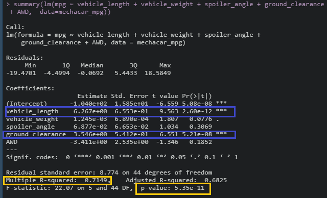
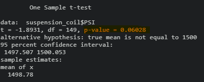
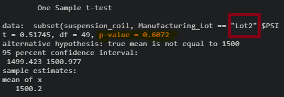
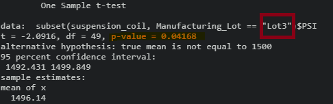

# _That New Car Smell_ ||  MechaCar Statistical Analysis

## Overview of Study

AutosRUs’ latest prototype, MechaCar has been delayed due to imminent issues in production, subsequently halting manufacturing. 
To find the root cause or insights to where the former issues lie, a statistical analysis of production data was conducted. 

## Resources 

* Data Source(s): [MechaCar_mpg.csv](insertlink) , [Suspension_Coil.csv](insertlink)
* Software/Tools: RStudio | Language(s): R| Libraries/Packages: JSON Lite, Tidyverse | VS Code 1.54.3

## Linear Regression to Predict MPG

In creating a linear regression model, it was determined the null hypothesis would suggest either one of the following characteristics or variables of MechaCar’s prototypes: vehicle length, vehicle weight, spoiler angle, ground clearance, All-wheel drive (AWD) is_ not_ related to the prototype’s Miles Per Gallon (MPG). 

In result, having relatively small p-values, it is safe to say that both vehicle length and ground clearance provided a non-random amount of variance to the MPG values, thusly, showing a level of (statistical) significance or strong correlation between the two coefficients. The former conclusion can also be gathered from the intercept values, as it would suggest there are, in fact, additional factors influencing the variance of _or_ in miles per gallon.

In looking at our p-value for the linear regression of 5.35 x 10-11   it is noted to be smaller than the assume pre-determined threshold (or assumed significance level) of 0.05 percent, given way to enough evidence to reject the null hypothesis and conclude the slope of the model is not zero. 

While, much can be gathered from the linear model, in terms of statistical significance, it is not ideal to in predicting the MPG of MechaCar prototypes effectively, as (1) there are many factors that are contributing to the variance in miles per gallon, aforementioned; and (2) the r-squared value of the model is 0.7149, meaning about **70 percent (%)** of the predictions _**would**_ be correct.
                    

  <i><b>Linear Regression Model Results</b></i> 
 
 

## Summary Statistics on Suspension
Keeping in mind design specifications for MechaCar should not exceed no more that 100 pounds per square inch (PSI), analysis of the suspension coil data variance, overall, shows, that, _yes_ current design specifications are met at roughly 62 PSI. 

  <i><b>Total Summary, PSI (Pound Per Square Inch)</b></i> 
 
 

  
Contrarily, in exploring the variance by Lot, we see there is a differentiation between the three. 

Specifically, while Lots 1 and 2, meet the design specification at 0.9795918 PSI and 7.4693878 PSI, respectively, Lot 3 does not meet design specification with a variance exceedingly well above requirements at roughly 170 pounds per square inch.

  <i><b>Per Lot Summary, PSI (Pound Per Square Inch)</b></i> 
 
 

## T-Tests on Suspension Coils

To determine or _“test”_  the null hypothesis: if each individually lot, as well as, all manufacturing lots, collectively are statistically different from the population mean of 1, 500 pounds per square inch (PSI), four separate t-test were performed. 

With a significance level of 0.05 percent for each test, the calculated p-value was notably, higher. In this regard, the means are _not_ statistically different (from the population mean) and leaves no sufficient evidence to reject the null hypothesis. Simply, the means are statistically similar. 

These findings can be seen in the visuals, below:

  <b>Image 1: Overall t-Test, Significance Level: 0.05%, p-value = 0.06028</b> 
  
 

 

  <b>Image 2: Lot 1 t-test, Significance Level: 0.05%, p-value = 1</b> 

 

 

  <b>Image 3: Lot 2 t-test, Significance Level: 0.05%, p-value: p-value = 0.6072
</b> 
 
 

 

  <b>Image 4: Lot 3 t-test, Significance Level: 0.05%, p-value = 0.04168</b> 
 
 

 
## Study Design: MechaCar vs Competition 
While, we can look internally, as we the test that we conducted above, to gain further insights into what would translate to success in a forthcoming product release, it is, too best to collect information externally for a well-rounded analysis—namely, a comparison study between MechaCar and its competitor.

With the future and existing consumer in mind, we can start to tackle what may _drive_ consumers to purchase a new car and what key factors drives those decisions such as, price, fuel-economy, maintenance, safety ratings to name a few. 

We should also delve into data to uncover trends to if the wake of the COVID-19 pandemic, to get a better understanding of buying trends, or how the global supply chain has been effect, and in term may affect what MechaCar can produce and release at this time.  

We can conduct a Chi-squared test to compare the frequency model types purchased/sold across, similar classes, i.e., 2-doors, 4-door models, RWD versus AWD, amongst our competitors. 

Questions that can be addressed if we, too, consider external factors as the pandemic:

 *  Are consumers opting to purchase larger vehicles to accommodate a family (in the pandemic)?
    *   Are consumers purchasing vehicles to avoid public transportation?
* Where are vehicles being purchased?

* The City versus the rural and suburban areas

* Have sales increased or decreased dure the pandemic? 

Additionally, we can rely on the A/B testing to decipher price points that would position MechaCar competitively to that of manufacturers with the same offerings. 

#### Author 

_Whitney D. Gardner_

 

  

 

 

  <i><b>Linear Regression Model Results</b></i> 
 
 

 
